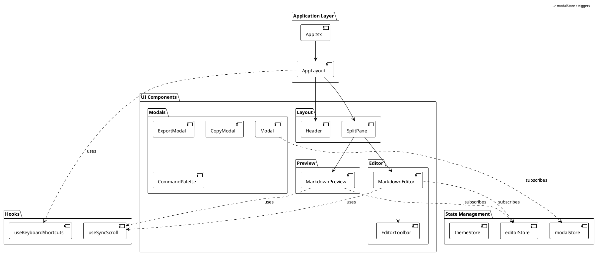
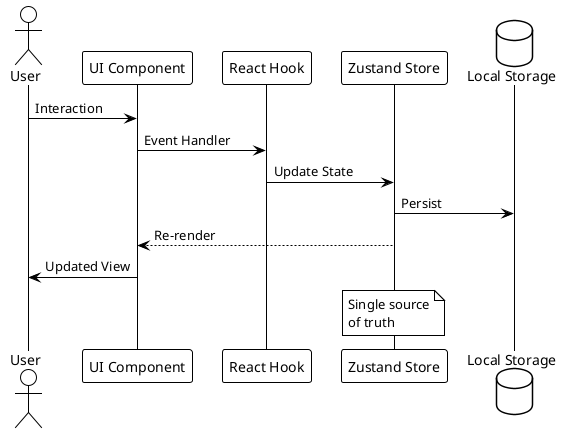
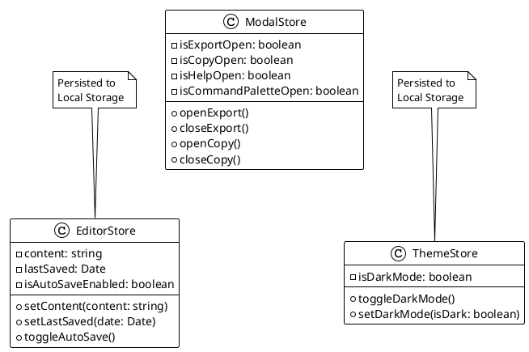
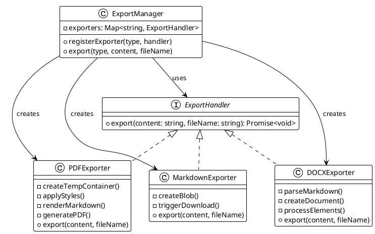
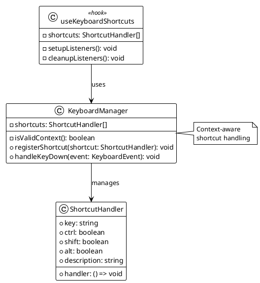
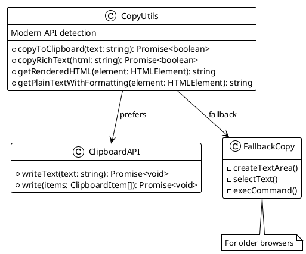
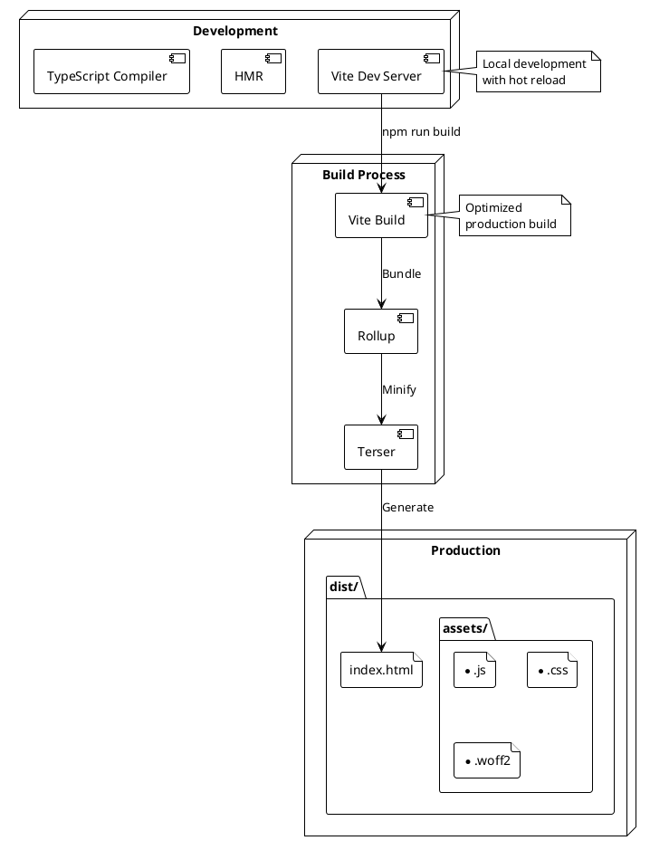
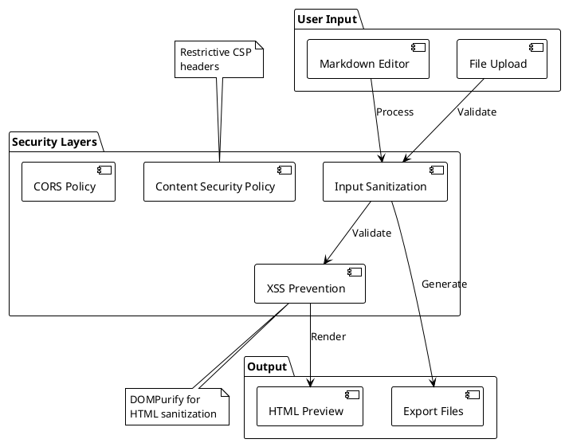
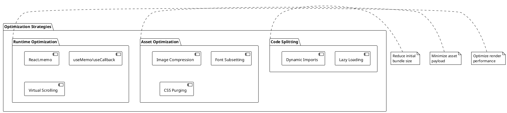
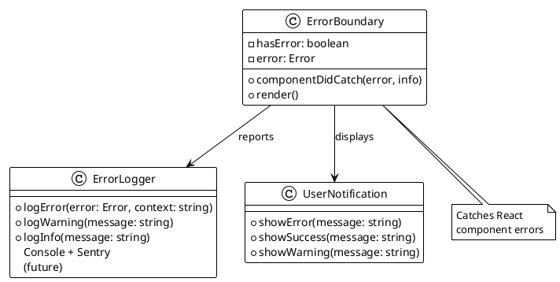

# Architecture Documentation

## Overview

The Markdown Editor is a single-page application (SPA) built with React and TypeScript. It follows a component-based architecture with clear separation of concerns between UI, state management, and business logic.

## System Architecture

```plantuml
@startuml System Architecture
!theme plain

skinparam componentStyle rectangle

package "Client Browser" {
  component [Markdown Editor SPA] {
    component [React Application] as app
    component [Local Storage] as storage
    component [Service Workers] as sw
  }
}

cloud "External Services" {
  component [CDN Assets] as cdn
  note right of cdn : Fonts, static assets
}

component [Web Server] as server
note right of server : Nginx/Apache\nStatic file hosting

[server] --> [app] : Serve SPA
[app] --> [storage] : Persist state
[app] --> [cdn] : Load assets
[app] --> [sw] : Offline support\n(future)

@enduml
```

## Component Architecture



## Data Flow Architecture



## State Management Architecture



## Export System Architecture



## Keyboard Shortcut System



## Copy System Architecture



## Deployment Architecture



## Security Architecture



## Performance Optimization



## Error Handling Architecture



## Technology Decisions

### Frontend Framework: React
- Component-based architecture
- Large ecosystem
- Excellent TypeScript support
- Virtual DOM for performance

### State Management: Zustand
- Minimal boilerplate
- TypeScript-first
- Built-in persistence
- DevTools support

### Build Tool: Vite
- Fast HMR
- Optimized production builds
- Native ES modules
- Built-in TypeScript support

### Styling: Tailwind CSS
- Utility-first approach
- Built-in dark mode
- Tree-shaking unused styles
- Consistent design system

## Scalability Considerations

1. **Code Splitting**: Lazy load heavy features like export functionality
2. **State Management**: Zustand scales well with proper store separation
3. **Component Architecture**: Modular design allows easy feature addition
4. **Build Optimization**: Vite provides excellent optimization out of the box
5. **Browser Storage**: IndexedDB for larger datasets (future enhancement)

## Future Architecture Enhancements

1. **Plugin System**: Allow third-party extensions
2. **Web Workers**: Offload heavy processing
3. **PWA Support**: Offline functionality
4. **Collaboration**: WebRTC for real-time collaboration
5. **Cloud Sync**: Optional cloud storage integration